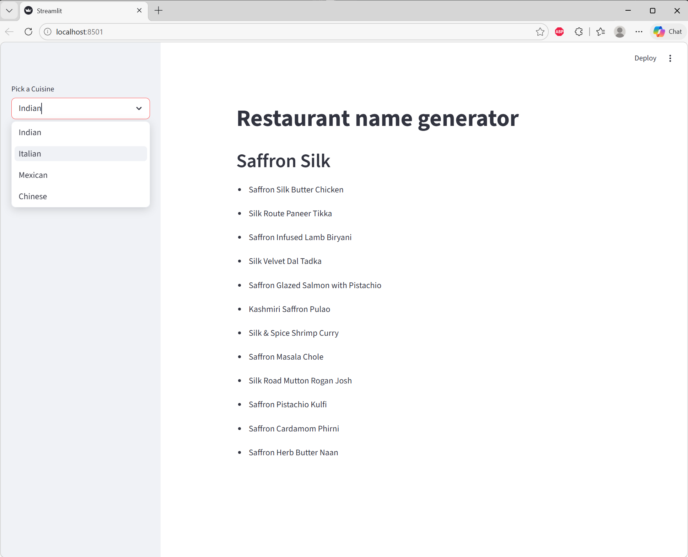

# Restaurant Name & Menu Item Generator

## Description

This is a **Restaurant Name and Menu Item Generator** built using **LangChain** and **OpenAI's GPT models**.  
The app allows users to pick a cuisine (e.g., Indian, Italian, Mexican, Chinese) and generates:

1. A **fancy restaurant name**  
2. A **list of signature menu items** for that restaurant

The app is built with **Streamlit** for an interactive web interface.

---

## Features

- Pick a cuisine from a dropdown  
- Automatically generate a restaurant name using OpenAI LLM  
- Generate a menu list for the restaurant  
- Easy to extend for additional outputs (e.g., slogans, specials)

---

## Tech Stack

- **Python 3.10+**  
- **LangChain** (modern LCEL)  
- **OpenAI GPT models**  
- **Streamlit** for frontend  